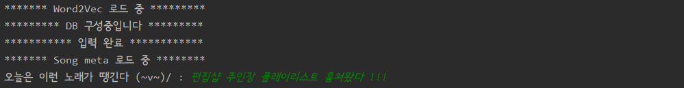
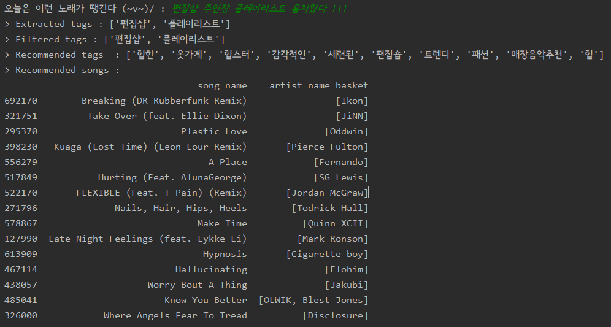
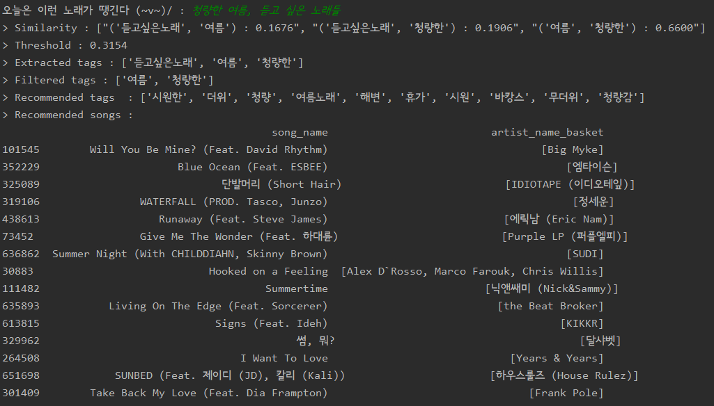
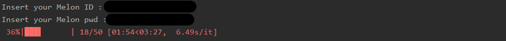

# 🎵 Title Based Playlist Generator 🎵

### 노래 추가는 내가 할게, 🙋 제목은 누가 지을래?  🤷‍♂

듣고 싶은 playlist의 제목을 지어주세요 !  

9만개의 멜론 플레이 리스트 데이터로 학습된 모델이 당신만의 플레이 리스트를 생성합니다.  

멜론 사용자 유저라면, 내 계정에 플레이 리스트에 추가할 수 있어요 ! : )  

  

  

:radio: 간단한 기능 설명 후, 구현 과정에서 고민했던 부분을 기술합니다.  

  

  

## USAGE

### 1. 플레이 리스트의 제목을 지어주세요.

`run.py`를 실행시키면, 추천에 필요한 데이터를 로드하고 사용자에게 플레이리스트 제목을 요청합니다.



  

  

### 2. 제목을 기반으로 적절한 태그를 추출한 후 플레이 리스트를 생성합니다.

제목에 어울리는 태그를 `Recommended tags`로 제공하고, 이를 기반으로 추천할 노래 리스트의 일부를 띄웁니다.

플레이 리스트는 기본 50곡이 추천되며 `ply_generator.title_based_recommend` 의 `topn` 변수를 통해 조절가능합니다.



  




### 3. 사용자의 Melon 계정에 접속하여 플레이 리스트를 생성합니다.

플레이 리스트를 추가할 사용자의 멜론 ID와 패스워드를 요청합니다.

Selenium을 통해 구현된 자동화 코드가 크롬 웹브라우저를 띄우고 곡을 추가합니다.



  

### 4. 추가된 플레이 리스트를 멜론에서 즐기세요 !

플레이 리스트는 실시간으로 어플에 반영됩니다. 나만의 플레이 리스트를 자동으로 생성하고 즐겨보세요 (606) /


## 구현 과정

### 1. 제목에서 태그 추출하기

Trie를 이용해서 DB를 구성한 후, 태그를 추출하는 방법에 대해 고민했습니다.

1. 가능한 모든 태그를 추출한다.
   * `여름에 듣고 싶은 노래` 를 입력하면 `여름, 여름에, 듣고, 듣고싶은, 듣고싶은노래` 가 추출됩니다.
2. 매칭되는 태그 중 가장 길이가 긴 태그를 추출한다.
   * `여름에 듣고 싶은 노래` 를 입력하면 `여름에, 듣고싶은노래` 가 추출됩니다.

전자의 방법을 사용하면 중요한 태그보다 노이즈가 더 많이 추출되는 경우가 빈번히 발생합니다.

한 번 등장한 태그는 한 번만 사용되는 것이 적절하다고 판단하였습니다. 또한 최대 길이로 매칭된 `여름에` 태그만으로도 `여름`이라는 정보를 충분히 반영할 수 있을 것으로 판단하였고 후자의 방법을 사용합니다.


### 2. 추출된 태그 필터링하기

`청량한 여름, 듣고싶은 노래들`을 입력하면 `청량, 여름, 듣고싶은노래들`이 추출됩니다.

그러나 `듣고싶은, 노래, 역시` 등과 같은 단어는 오히려 noise가 되어 추천을 방해합니다. 중심 태그와 큰 관련이 없는 태그를 걸러줄 필요가 있습니다.

다음 과정에 따라 태그를 선택합니다.

1. 추출된 N개의 태그에서 N combination 2개의 쌍을 생성하고 cosine similarity를 계산합니다.

2. 유사도가 0.1보다 낮은 태그 쌍을 1차적으로 제거합니다.

3. 남은 태그쌍을 이용하여 0.3분위수를 계산하고 threshold 이하인 경우에 해당 태그 쌍을 제거합니다.

남은 태그 쌍만을 이용하여 노래 추천에 사용합니다.

  

ex ) **Title : "청량한 여름, 듣고 싶은 노래들"**

```python
> Similarity : ["('청량한', '듣고싶은노래') : 0.1906", "('청량한', '여름') : 0.6600", "('듣고싶은노래', '여름') : 0.1676"]
> Threshold : 0.3154 # 0.3분위수 계산
> Extracted tags : ['청량한', '듣고싶은노래', '여름'] # 유사도가 0.1인 태그 쌍
> Filtered tags : ['청량한', '여름'] # 그 중 threshold를 넘은 태그 쌍
> Recommended tags  : ['시원한', '더위', '청량', '여름노래', '해변', '휴가', '시원', '바캉스', '무더위', '청량감']
```

noise로 판단한 `듣고싶은노래`가 threshold에 의해 제거됩니다.

  

### 3. 태그를 기반으로 플레이 리스트 생성하기

추출된 태그의 embedding을 모두 더한후 가장 가까운 (코사인 유사도 이용) song을 top N개 만큼 추천합니다.

### 4. 생성한 플레이 리스트를 사용자의 멜론 계정에 추가하기
자세한 구현 과정은 [Melon-playlist-generater Repo](https://github.com/haeuuu/Melon-playlist-generater)에서 확인할 수 있습니다.
  

## 보완할 부분

**태그를 학습하기 전 전처리를 거친다.**

* 현재는 raw 데이터를 그대로 이용하였음. 그러나 `여름, 여름에, 여름엔` => `여름` 으로 통일할 필요가 있어보임.
* 조사를 제거하거나 noise가 될 수 있는 태그(`노래, 듣고싶은, 역시` 등)를 제거할 방법을 생각해보아야함.