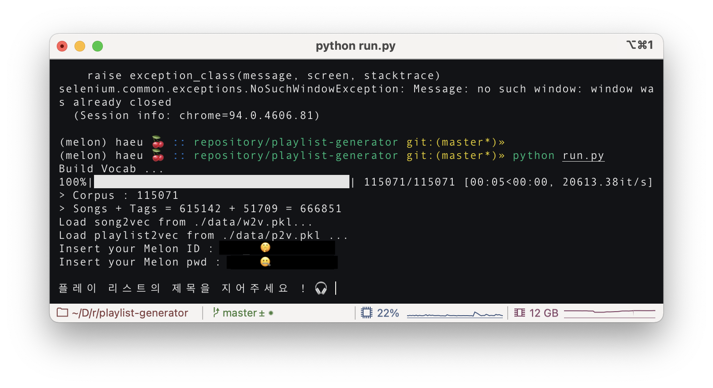

# 🎵 Title Based Playlist Generator 🎵

### 노래 추가는 내가 할게, 🙋 제목은 누가 지을래?  🤷‍♂

듣고 싶은 playlist의 제목을 지어주세요 !  

9만개의 멜론 플레이 리스트 데이터로 학습된 w2v 모델이 **제목에 어울리는 노래를 찾아 당신만의 플레이 리스트를 생성**합니다.  

자동화된 프로그램이 사용자의 **멜론 계정에 접속하여 자동으로 플레이 리스트를 생성**합니다.

  

##  USAGE

#### **1 ) 만들고 싶은 플레이 리스트의 제목을 입력합니다.**

  

  

#### **2 ) 저장된 플레이 리스트 중에서 유사한 플레이 리스트 50개를 찾고 자주 등장한 노래와 태그를 추출합니다.**

- 사용자가 입력한 제목에서 word2vec에 학습된 단어만 추출합니다.
- 추출된 단어의 embedding을 weighted sum 하여 title embedding을 생성합니다.
- 생성된 embedding과 가장 유사한 제목을 가진 플레이 리스트 50개를 찾아 노래를 추천합니다.

  

  

#### **3 ) 멜론에 이미 존재하는 플레이 리스트 중에서 사용자의 요청과 유사한 플레이 리스트 3개를 추천합니다.**

  

  

#### 4 **) 멜론 아이디와 비밀번호를 입력하면, Selenium으로 구현된 코드가 멜론에 노래를 자동으로 등록합니다.**

  

  

#### **5 ) 웹에서 생성된 플레이 리스트는 어플에 실시간으로 반영됩니다. 멜론 어플을 열고 생성된 플레이 리스트를 즐기세요 !** 🥰

  

  

### 🔑 사용 기술 관련 키워드

- word2vec
- BM25
- Trie
- Selenium
- Pytorch

 
 ### 🤔 개발 기록
 개발하면서 겪었던 문제와 고민에 대해 기술합니다.  
 [제목에서 태그를 추출하는 방법](https://github.com/haeuuu/Title-Based-Playlist-Generator/blob/master/How%20to%20extract%20tag%20from%20title.md)
